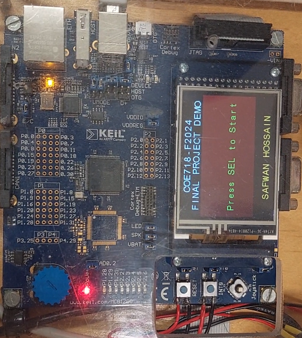
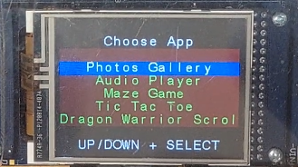
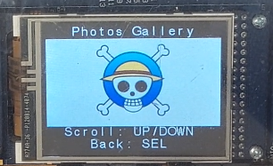
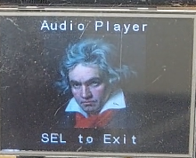
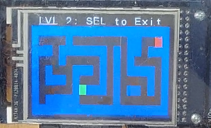
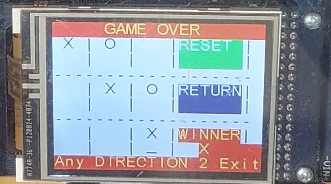
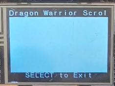
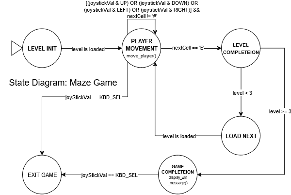
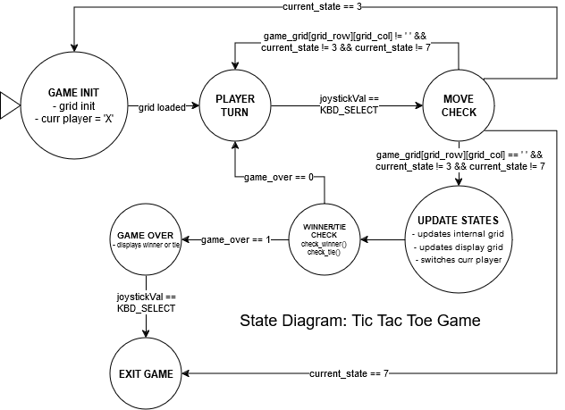

## Project Goal
In this project, a multimedia center was developed on an MCB1700 Development Board featuring the LPC1768 microcontroller. The goal was to explore the capabilities of the ARM Cortex-M3 architecture in embedded systems applications. The MCB1700 board is equipped with several modules, including an LCD, joystick, potentiometer, and LEDs, which were utilized to create an interactive user interface and multimedia functionalities.

    

### Applications
The multimedia center has a menu-driven system that allows users to navigate through various applications: an image gallery, an audio player, and a collection of games. The image gallery displays pre-loaded images that users can scroll through using the joystick. The audio player streams audio from a connected computer via USB to the board’s speaker, effectively turning the board into a secondary audio device. The gaming section includes implementations of Tic-Tac-Toe, a maze game, and an homage to a joke related to the movie “Kung Fu Panda.” All this in combination provided interactive entertainment and demonstrated real-time input handling and graphics rendering on an embedded system.

The main menu serves as the entry point of the multimedia center, providing navigation to the different applications. The image gallery allows users to scroll through a set of preloaded images. Images were converted to C-source format using GIMP, ensuring they are in a compatible RGB565 (16-bit). The audio player streams audio from a connected computer via USB to the LPC1768’s output. A maze game where the player navigates through a maze using the joystick to reach an exit. The maze is represented as a 2D character array, and the LCD displays the maze grid. A two-player Tic-Tac-Toe game implemented with state transitions to manage cursor movements and game logic. The appli cation also has a reset and return capability. Finally, an homage to a joke related to the movie “Kung Fu Panda,” serving as an Easter egg

    <table>
    <tr>
        <td></td>
        <td></td>
    </tr>
    <tr>
        <td></td>
        <td></td>
    </tr>
    <tr>
        <td></td>
        <td></td>
    </tr>
    </table>

### System Design
#### Abstractions
Custom helper files (e.g., GLCD.h, KBD.h, LED.h, etc.) provided abstraction layers for hardware interaction, simplifying the main application code and allowing for easier hardware management.
#### State Diagrams
The maze game state diagram is shown below:

    

The tic-tac-toe game state diagram is shown below:

    

